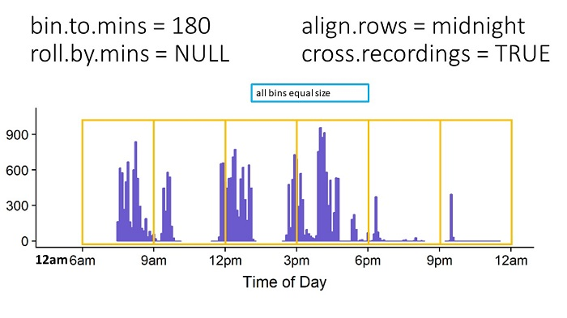
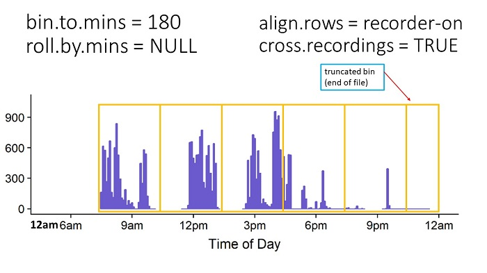
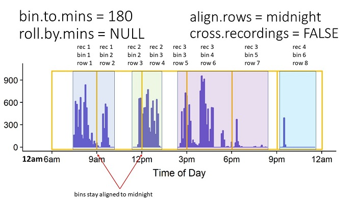

```{r, include = FALSE}
knitr::opts_chunk$set(
  collapse = TRUE,
  comment = "#>"
)
```

```{r setup, echo = FALSE}
library(ITSbin)
```


The purpose of this vignette is to give further explanation and illustration of the options for the `bin_seconds` function. 

All graphs display Adult Word Count (allAdultWords) in 5-minute bins across 1 full day for 1 .its file. While the function will be calculated from seconds, not 5-minute bins, 5-minute bins are easier to visualize. Periods where the purple line is flat indicate the recorder was on, but there were no adult words. Breaks in the purple line indicate the recorder was off at this time. Orange-outline boxes indicate the time period that goes into each bin.

## align.rows: midnight or recorder-on

Character. opts = c("midnight", "recorder-on") Should the first bin start at midnight (00:00:00) the day the recorder was turned on ("midnight") or the first second in which the recorder was on ("recorder-on")

The first option to consider is whether your rows should align to midnight or align to when the recorder was first turned on.

### `align.rows = "midnight"`

If you select "midnight" and bin to 180-minute bins (3 hours), the first row will run from 00:00:00.00 to 02:59:59.99, the second from 03:00:00.00 to 05:59:59.99, and so on. There will be empty rows before the recorder was turned on, which can be removed later by subsetting your dataset to `recOn >0`. This option can be useful if you plan to align your data with other data sources, such as a diary log.

*NOTE: This option is consistent with how ADEX bins data.*



### `align.rows = "recorder-on"`

If you select "recorder-on" and bin to 180-minute bins, the first row will encompass 180 minutes from whenever the recorder was first turned on. If the recorder was turned on at 8:23:19 am, then the first 2 rows would be 1) 8:23:19.00 to 11:23:18.99, 2) 11:23:19.00 to 14:23:18.99. This is desirable if your research question relies less on the specific time of day and more on using all available complete bins.



## cross.recordings: TRUE or FALSE

Logical. Should bins be calculated across or within recordings? (default = TRUE)

Should the function calculate across periods when the recorder was turned off and on again (`TRUE`) or separate bins whenever the recorder was turned off and on again within a bin (`FALSE`).

*NOTE: Some versions of ADEX calculate across recordings, while other versions separate recordings.*

The below images compare how cross.recordings is calculated, first with `align.rows = "midnight"`, then with `align.rows = "recorder-on"`.

In the example .its file, the recorder was turned on and off a total of 4 times, resulting in 4 "Recordings".

### `align.rows = "midnight"` & `cross.recordings = TRUE`

If `cross.recordings = "TRUE"`, the bin_seconds function will effectively ignore periods when the recorder was turned off, and calculate across these. It does output the number of seconds the recorder was turned on/off during each bin, so the user still knows when there is an incomplete bin of recording time. The user will not know precisely when the recorder was turned on & off if the recorder was turned off and back on again *within the same bin*. In the example below, during the 9am-12pm bin, the user would know how long the recorder had been on/off, with a single row summarizing the entire 9am-12pm period.


### `align.rows = "midnight"` & `cross.recordings = FALSE`

In the example below, during the 9am-12pm bin, the function would output 3 rows: 1 for the period of recording 1 within bin 2, 1 for the period the recorder was off during bin 2, and 1 for the period of recording 2 within bin 3. All rows/bins stay aligned to midnight. Either the start, end, or both the start and end of each row will be 180 minutes relative to midnight.




roll.by.mins


subset.by.column


drop.by.subset


