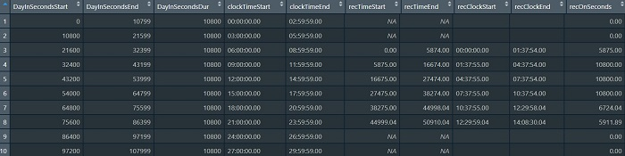
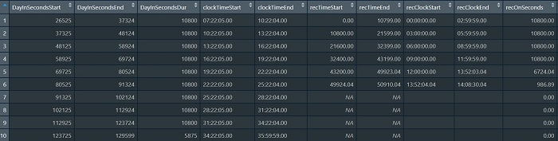

```{r, include = FALSE}
knitr::opts_chunk$set(
  collapse = TRUE,
  comment = "#>"
)
```

```{r setup, echo = FALSE}
library(ITSbin)
```


The purpose of this vignette is to give further explanation and illustration of the options for the `bin_seconds` function. The `bin_seconds` function is useful if, for instance, you want to know how many adult words LENA captured in each hour, or how many conversational turns LENA captured every 3 hours. This function allows you to *flexibly* bin into different bin sizes (eg, 5, 30, 180 minutes, or the total recording day). The many user options are detailed below. 

All graphs display Adult Word Count (allAdultWords) in 5-minute bins across 1 full day for 1 .its file. While the function will be calculated from seconds, not 5-minute bins, 5-minute bins are easier to visualize. Periods where the purple line is zero indicate the recorder was on, but there were no adult words. Breaks in the purple line indicate the recorder was off at this time. Orange-outline boxes indicate the time period that goes into each bin.

## align.rows: midnight or recorder-on

`align.rows` Character. opts = c("midnight", "recorder-on") Should the first bin start at midnight (00:00:00) the day the recorder was turned on ("midnight") or the first second in which the recorder was on ("recorder-on")

The first option to consider is whether your rows should align to midnight or align to when the recorder was first turned on.

### `align.rows = "midnight"`

This option can be useful if you plan to align your data with other data sources, such as a diary log.

If you select "midnight" and bin to 180-minute bins (3 hours), the first row will run from 00:00:00.00 to 02:59:59.99, the second from 03:00:00.00 to 05:59:59.99, and so on. There will be empty rows before the recorder was turned on, which can be removed later by subsetting your dataset to `recOn >0`. 

*NOTE: This option is consistent with how ADEX bins data.*


**Example data output - click to zoom:**

[  ](bin_seconds-options/useroptions_midnightseqCRTRUE_dataframe_large.jpg)


### `align.rows = "recorder-on"`

This option can be useful if your research question relies on using all available data without regard for time of day.

If you select "recorder-on" and bin to 180-minute bins, the first row will encompass 180 minutes from whenever the recorder was first turned on. If the recorder was turned on at 8:23:19 am, then the first 2 rows would be 1) 8:23:19.00 to 11:23:18.99, 2) 11:23:19.00 to 14:23:18.99.


**Example data output - click to zoom:**

[  ](bin_seconds-options/useroptions_recorder-onseqCRTRUE_dataframe_large.jpg)


## cross.recordings: TRUE or FALSE

`cross.recordings` Logical. Should bins be calculated across or within recordings? (default = TRUE)

Should the function calculate across periods when the recorder was turned off and on again (`TRUE`) or separate bins whenever the recorder was turned off and on again within a bin (`FALSE`).

*NOTE: Some versions of ADEX calculate across recordings, while other versions separate recordings.*

The below images compare how cross.recordings is calculated, first with `align.rows = "midnight"`, then with `align.rows = "recorder-on"`.

In the example .its file, the recorder was turned on and off a total of 2 times, resulting in 2 "Recordings".

### `align.rows = "midnight"` & `cross.recordings = TRUE`

If `cross.recordings = "TRUE"`, the bin_seconds function will effectively ignore periods when the recorder was turned off, and calculate across these. It does output the number of seconds the recorder was turned on/off during each bin, so the user still knows when there is an incomplete bin of recording time. The user will not know precisely when the recorder was turned on & off if the recorder was turned off and back on again *within the same bin*. In the example below, during the 6pm-9pm bin, the user would know how long the recorder had been on/off, with a single row summarizing the entire 6pm-9pm period.


**Example data output - click to zoom:**

[  ](bin_seconds-options/useroptions_midnightseqCRTRUE_dataframe_large.jpg)


### `align.rows = "midnight"` & `cross.recordings = FALSE`

In the example below, during the 6pm-9pm bin, the function would output 3 rows: 1 for the period of recording 1 within the 6pm-9pm bin, 1 for the period the recorder was off during the 6pm-9pm bin, and 1 for the period of recording 2 within the 6pm-9pm bin. All rows/bins stay aligned to midnight.


**Example data output - click to zoom:**

[  ](bin_seconds-options/useroptions_midnightseqCRFALSE_dataframe_large.jpg)


### `align.rows = "recorder-on"` & `cross.recordings = FALSE`

This option is equivalent to the above combination, except with the bin calculation beginning when the recorder was turned on. For `align.rows = "recorder-on"`, when the recorder is turned off and back on, the next row/bin will start when the recorder was turned on again without regard for either midnight or when the recorder was first turned on.


**Example data output - click to zoom:**

[  ](bin_seconds-options/useroptions_recorder-onseqCRFALSE_dataframe_large.jpg)


## Rolling Windows

`roll.by.mins` Numeric. Default = NULL (sequential bins, eg 0-59, 60-119) How many minutes between bins (or, do bins overlap?). Ex, if bin.to.mins = 60 & roll.by.mins = 1, then 1st bin = minutes 0-59, 2nd bin = mins 1-60, 3rd = mins 2-61, etc.

What if you are interested in finding what 3-hour window in each recording day contained the most adult words? In the first example (`align.rows = "midnight"`), this would be the 6-9pm window at 5200 words. However, if you calculated the maximum 3-hour word count by moving the calculation window by 1 hour throughout the day, the maximum window would be 5pm-8pm at 6300 words. The rolling windows option allows you to do this. See below for illustration & example dataframe.

### `roll.by.mins = 60`


**Example data output - click to zoom:**

[  ](bin_seconds-options/useroptions_midnightRW60CRTRUE_dataframe_large.jpg)


## subset.by.column

`subset.by.col` Character. Include only rows where this column is NOT 0 (default = NULL). To include only seconds when the recorder was turned on, set subset.by.col = "recOn" & drop.by.subset = TRUE.

The final option allows the user to select data based on a specific column. In the below example, the researcher has a diary log indicating when the child was at home or out of the home. A column "athome" is added to the EXAMPLE_sec.csv dataset, with 0 = "out of home" and 1 = "at home". The researcher only wants to use data from when the child was at home, and this family indicated they were out of the home from 1pm-3pm.


## drop.by.subset

`drop.by.subset` Logical. If subset column is specified, should rows where subset.by.col == 0 be removed entirely (TRUE) or set to NA (FALSE)? To include only seconds when the recorder was turned on, set subset.by.col = "recOn" & drop.by.subset = TRUE.

### `drop.by.subset = FALSE`

If the researcher wants to preserve the time information present in the full dataset, they should set `drop.by.subset = FALSE`. In this option, wherever "athome" = 0, the data will be set to NA, as though the recorder were simply not capturing data. See below for example data output.

**Example data output - click to zoom:**

[  ](bin_seconds-options/useroptions_dropbycolumn_NA_dataframe_large.jpg)


### `drop.by.subset = TRUE`

If the researcher wants to remove that time entirely, they should select `drop.by.subset = TRUE`. The function will then drop all data where "athome" = 0 *before* calculating bins. See below for example data output.

**Example data output - click to zoom:**

[  ](bin_seconds-options/useroptions_dropbycolumn_drop_dataframe_large.jpg)


